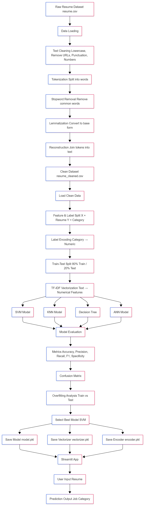
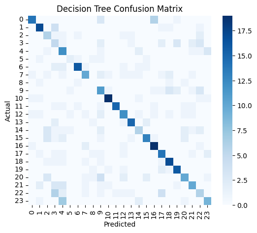

# Resume Analyzer using NLP & Machine Learning

---

## 📌 Overview

This project implements a complete **Resume Analyzer system** using **Natural Language Processing (NLP)** and **Machine Learning** techniques.

The system processes raw resume text and classifies it into predefined job categories such as HR, Engineering, Finance, and IT.

---

## 🖼️ System Workflow



---

## 🎯 Problem Statement

Given a resume, the goal is to automatically predict its **job category**.

This is a:

* Supervised Learning problem
* Multi-class Classification problem

---

## 📊 Dataset

* Total resumes: **2484**
* Total categories: **24**

### Features:

* `Final_Resume` → Cleaned resume text
* `Category` → Target label

---

## 📁 Project Structure

```
ml-project/
│
├── resume.csv
├── resume_cleaned.csv
│
├── notebook1_nlp.ipynb
├── notebook2_ml.ipynb
│
├── output/
│   ├── model.pkl
│   ├── vectorizer.pkl
│   └── encoder.pkl
│
└── images/
    ├── workflow.png
    ├── confusion_matrix.png
    └── results.png
```

---

## 🧠 NLP Pipeline


Steps performed:

1. Text Cleaning

   * Lowercasing
   * Removing URLs, punctuation, numbers

2. Tokenization

3. Stopword Removal

4. Lemmatization

5. Text Reconstruction

Output:

```
resume_cleaned.csv
```

---

## ⚙️ Feature Extraction

TF-IDF (Term Frequency – Inverse Document Frequency):

* Converts text → numerical vectors
* Max features: **5000**
* Sparse high-dimensional representation

---

## 🤖 Machine Learning Models

The following models were trained and evaluated:

* Support Vector Machine (SVM)
* K-Nearest Neighbors (KNN)
* Decision Tree (CART - Gini Index)
* Artificial Neural Network (ANN)

---

## 📈 Model Evaluation



Metrics used:

* Accuracy
* Precision (Weighted)
* Recall (Weighted)
* F1 Score (Weighted)
* Specificity
* Confusion Matrix

---

## 📊 Overfitting Analysis

| Model         | Behavior     |
| ------------- | ------------ |
| Decision Tree | Overfitting  |
| ANN           | Overfitting  |
| SVM           | Balanced     |
| KNN           | Underfitting |

---

## 🏆 Final Model Selection

**Support Vector Machine (SVM)** was selected as the best model due to:

* Balanced bias-variance tradeoff
* Strong performance on high-dimensional TF-IDF data
* Better generalization on unseen data

---

## 💾 Saved Artifacts

* `model.pkl` → Trained SVM model
* `vectorizer.pkl` → TF-IDF transformer
* `encoder.pkl` → Label encoder

---

## 🔄 How It Works

```
Input Resume
    ↓
Text Cleaning
    ↓
TF-IDF Vectorization
    ↓
SVM Prediction
    ↓
Category Output
```

---

## 🧩 Key Concepts Covered

* Natural Language Processing (NLP)
* TF-IDF Vectorization
* SVM, KNN, Decision Trees, ANN
* Overfitting & Underfitting
* Precision, Recall, F1 Score
* Confusion Matrix
* Model Deployment using Pickle

---

## 🚀 Future Work

* Build Streamlit web application

---

## 👨‍💻 Authors

* Mandeep Singh
* Shubham Raj

---

## 📜 License

This project is licensed under the MIT License.

See the LICENSE file for details.

---

## 📌 Conclusion

This project demonstrates a complete end-to-end machine learning pipeline for resume classification, combining NLP preprocessing with multiple models to build an effective Resume Analyzer system.